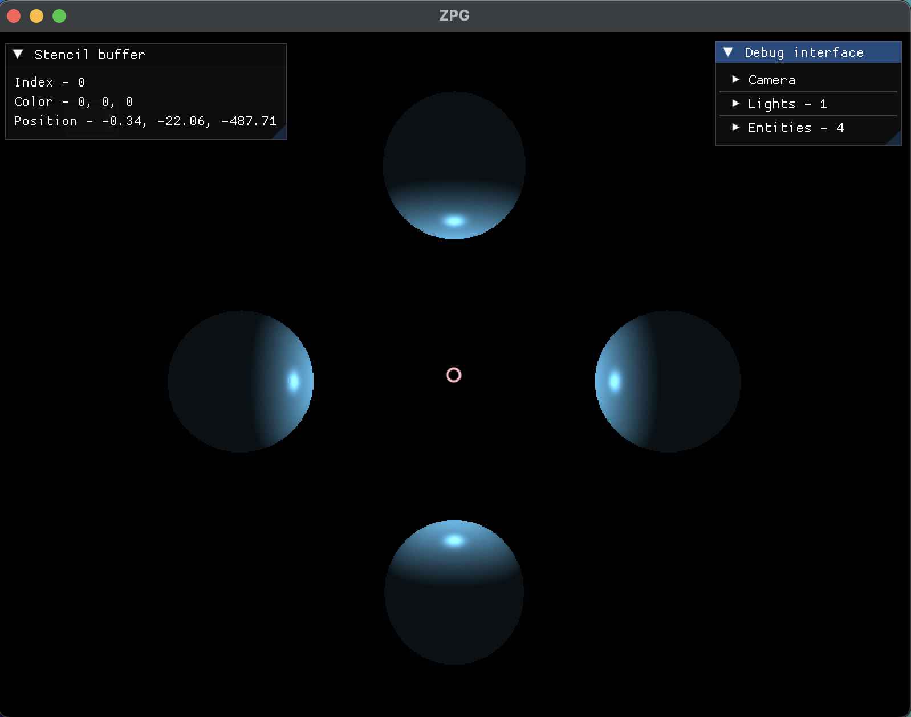
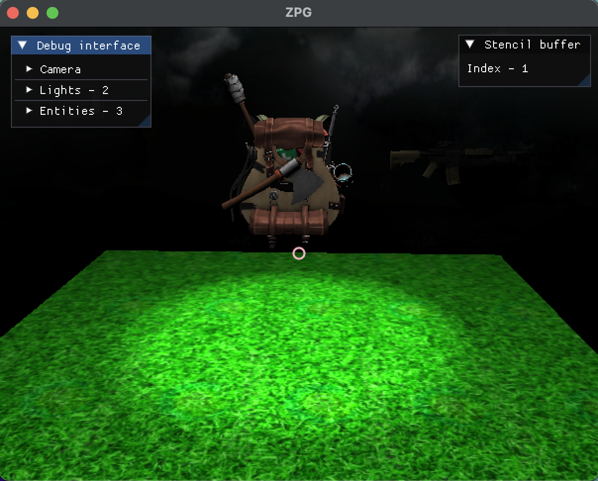
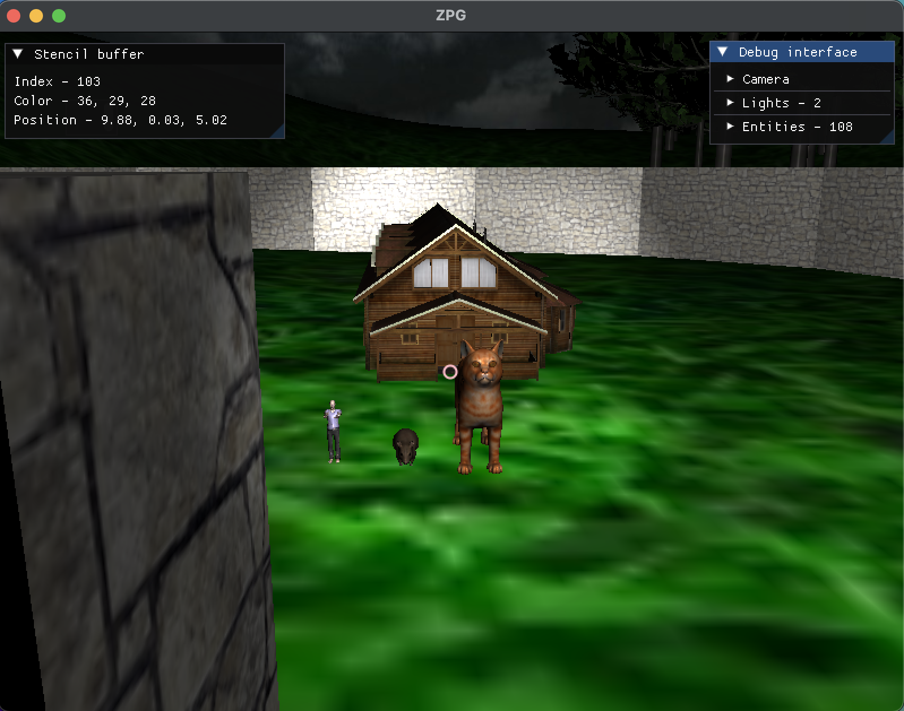

# Simple OpenGL Engine
This project was created for my Fundamentals of Computer Graphics course.

## Functionality
- Loading of 3D models (using Assimp)
- Shaders (Constant, Lambertian, Phong, Blinn-Phong)
- Lighting (Point, Directional, Spot)



- Camera controls
- Transformations (Translation, Rotation, Scaling)
- Textures



- Usage of Stencil Buffer to place objects
- Movement along a Bezier curve
- Simple debug interface (using ImGui)
- Skybox



## Dependencies
- [GLFW](https://www.glfw.org/) (3.3+)
- [GLEW](http://glew.sourceforge.net/)
- [GLM](https://glm.g-truc.net/0.9.9/index.html)
- [Assimp](https://www.assimp.org/)

## Included Libraries
- [stb_image.h](https://github.com/nothings/stb/blob/master/stb_image.h)
- [imgui](https://github.com/ocornut/imgui)

## Building
```bash
mkdir build
cd build
cmake ..
make
```
